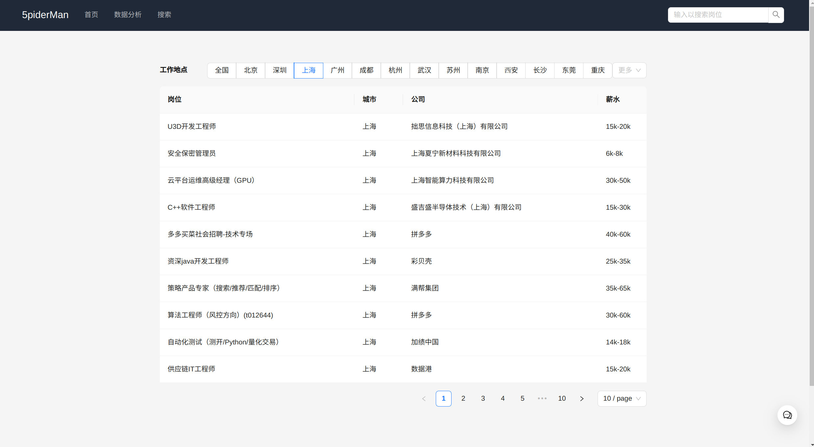

# 5piderMan

[](https://github.com/5piderMan-Team/5piderMan/actions/workflows/docker-and-deploy.yml)

接入 ChatGPT 的拉勾网岗位分析平台

## 展示

### 首页



### 分析页面


### AI 小助手


## Backend

### 配置文件

使用 dynaconf 加载配置文件。更多用法请查阅 [dynaconf docs](https://www.dynaconf.com/)

配置文件位于 `src/backend/config/` 中，`settings.toml` 用于一般配置，`.secrets.toml` 用于一些存储一些私密配置，例如数据库密码。
同时私密配置也可配置在环境变量或者`.env`文件中。前缀为`5PIDERMAN`。

```toml
host = "0.0.0.0"
port = 8080
db_host = 'localhost'
db_port = 3306
db_user = 'user'
db_password = 'password'
db_name = 'db'
db_type = 'mysql'
db_api = 'pymysql'
OPENAI_API_KEY = "sk-*****"
OPENAI_API_HOST = "https://api.openai.com"
```

部分 OpenAI 的代理商的 OPENAI_API_HOST 后要加上 /v1

### 依赖项管理

使用 [Poetry](https://python-poetry.org/) 作为包管理器。可以使用以下命令安装 Poetry 或者查阅[官方文档](https://python-poetry.org/docs/)：

```bash
pip install poetry
```

安装项目依赖：

```bash
poetry install
```

添加依赖：

```bash
poetry add packagename
```

### 项目启动

```bash
poetry install
backend
```

## Frontend

前端技术栈： Vite + React + Antd + Tailwindcss + Echarts

### 依赖

- nodejs 18+
- yarn 1.x

### 开发

```bash
yarn # 安装依赖
yarn dev # 开发
yarn build # 构建
```

## LICENSE

[GPLv3](./LICENSE)
